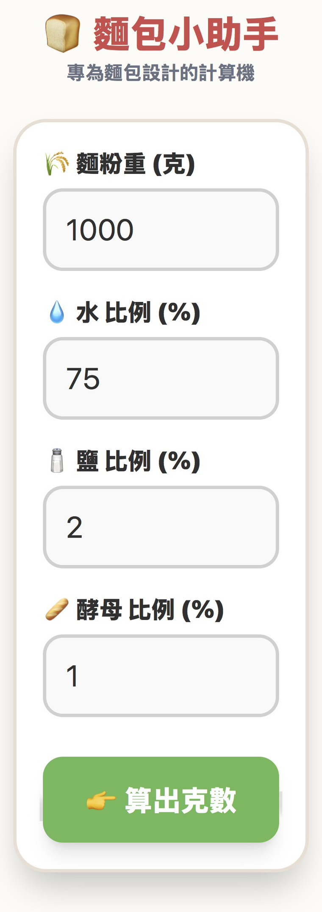
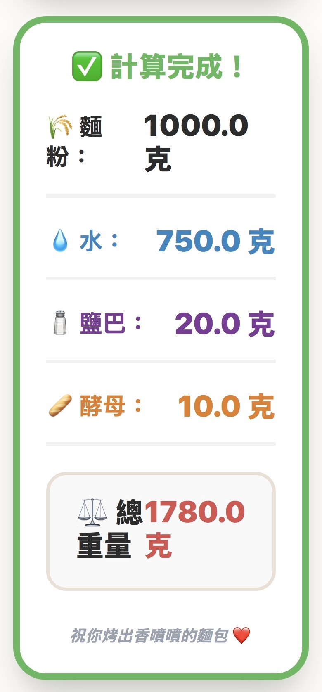

# 🍞 烘焙小幫手 (Baking Assistant)

[English Description below](#english-version)

### 🔗 [立即使用 (Live Demo)](https://an0928.github.io/BakingAssistant/)

這是一個專為長輩設計的烘焙百分比計算機。
本專案的初衷是解決傳統烘焙計算對長輩而言字體太小、邏輯複雜且輸入不便的問題。透過**需求訪談**與**迭代設計**，將複雜的配方換算轉化為直覺的數位工具。

## ✨ 專案特點 (Key Features)
- **長輩友善 UI：** 採用超大字體與高對比色彩，確保在廚房忙碌時也能輕鬆閱讀。
- **直覺式輸入：** 將麵粉、水、鹽、酵母拆分為獨立輸入框，避免輸入錯誤。
- **智慧記憶功能：** 自動保存上次使用的比例，下次只需修改麵粉重即可一鍵計算。
- **行動端優化：** 響應式網頁設計，支援「加入手機主畫面」作為 Web App 使用。

## 🛠️ 技術棧 (Tech Stack)
- **Core Development:** HTML, CSS3, JavaScript
- **AI-Assisted Engineering:** Developed with Google AI Studio (Gemini) for rapid prototyping and logic optimization.
- **Deployment:** GitHub Pages

## 📸 介面截圖 (Screenshots)
下圖展示為 **行動裝置 (Mobile)** 實際操作畫面：
| 輸入介面 (Input) | 計算結果 (Result) |
|---|---|
|  |  |

---

# 🍞 Baking Assistant

A mobile-friendly baking calculator specifically designed for senior users.  
This project demonstrates the process of **translating ambiguous user pain points into a structured digital solution**, focusing on accessibility and error-resistant design.

## 🚀 Key Highlights
- **Senior-Friendly UX:** High-contrast colors and extra-large typography for enhanced readability.
- **Simplified Workflow:** Streamlined the complex baker's percentage logic into a 3-step intuitive process.
- **Smart Persistence:** Local storage integration to remember user preferences and past ratios.
- **Product Thinking:** Prioritized core functionality over feature complexity to ensure a low learning curve.

## 📈 Project Status
- [x] Baker's Percentage Calculator: Core calculation logic for flour, water, salt, and yeast.
- [x] Mobile-Responsive Design: Optimized for kitchen environments and on-the-go usage.
- [ ] Sourdough Fermentation Scheduler (Next Phase):
    - Automating the timeline from Levain build to Bulk Fermentation and Final Proof.
    - Inspired by professional sourdough workflows to help users manage 24-48 hour baking cycles.

---
Developed by **Phoenix Lai**